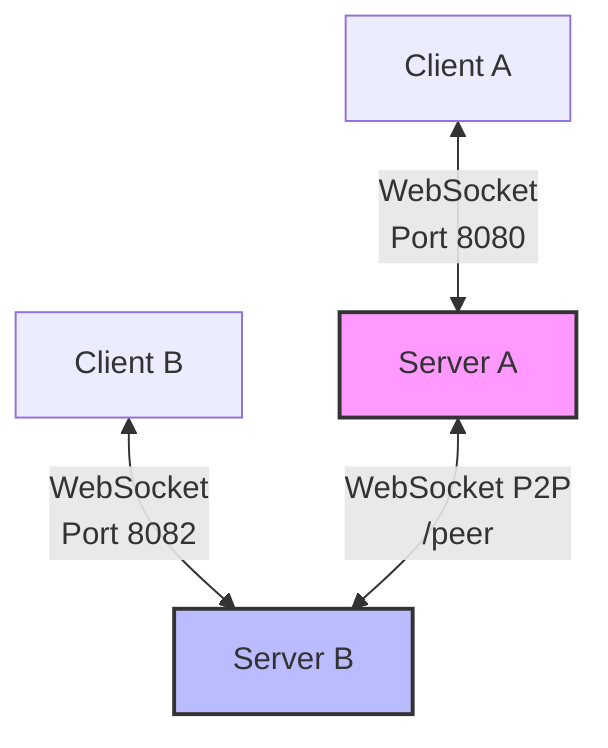

# Distributed P2P Gossip Sync Architecture

This document describes the architectural layout of our multi-server Gossip Replication mesh network.

---

## 1. Network Topology Model

Our synchronization mesh runs on a peer-to-peer (P2P) model where client replicas can connect to different server instances. The servers peer with each other to synchronize updates.



* **Client-Server Connections:** Clients connect to a local relay server via `/ws`. Clients only transmit their local edit operations and receive updates from the server.
* **Server-Server Peering:** Servers connect to other servers via `/peer`. Any updates received by one server are relayed to connected clients and gossiped to peer servers.

---

## 2. Communication Protocol & Messages

All communication runs over WebSockets using JSON-serialized messages.

```go
type Message struct {
	Type       MessageType          `json:"type"`
	DocID      string               `json:"doc_id"`
	Op         *crdt.Op             `json:"op,omitempty"`
	History    []crdt.Op            `json:"history,omitempty"`
	SyncAll    map[string][]crdt.Op `json:"sync_all,omitempty"`
	IsResponse bool                 `json:"is_response,omitempty"`
}
```

### Protocol Flow

1. **Client Hydration (Handshake):**
   * Client connects to `/ws` and sends `MsgSync`.
   * Server responds with `MsgInit` containing the full history array (`History`) of operations.
2. **Real-time Edits:**
   * When a client edits the text, it broadcasts a `MsgOp` containing a single `crdt.Op`.
   * The server appends it to its document history, relays it to other local clients, and gossips it to connected peer servers.
3. **Peer Handshake (`MsgPeerSync`):**
   * When Server B dials Server A at `/peer`, Server B initiates a handshake by sending its full multi-document history map.
   * Server A merges Server B's operations, updates its local clients, and responds with its own document history map.

---

## 3. Concurrency, Locks, and Thread-Safety

### Server State Locking
The server manages multiple document `sessions` and `peers` using a combination of read-write and mutual exclusion locks:
* **Server Lock (`sync.RWMutex`):** Protects the `sessions` map.
* **Session Lock (`sync.Mutex`):** Protects access to client connections and the operation `history` array within a specific document session.
* **Peers Lock (`sync.RWMutex`):** Protects the active peer server connection set (`peers`).

### Document State Locking
On the client, the `Document` struct enforces thread safety using a single `sync.RWMutex` to lock operations like `LocalInsert`, `LocalDelete`, `Apply`, and `ToString`.

---

## 4. Loop Prevention & Symmetrical Deduplication

To prevent infinite forwarding loops in cyclical peer graphs, the servers maintain an operation history log.
* **Duplicate Detection:** When an operation `op` is received from a peer, the server checks if it already possesses the operation.
* **Composite Deduplication Key:** To prevent collisions between concurrent edits and deletions on the same character, the deduplication logic checks both the operation `ID` and its `Type`:
  ```go
  if existingOp.ID == op.ID && existingOp.Type == op.Type {
      // Ignore gossip loop
  }
  ```

---

## 5. Testing & Diagnostics Infrastructure

We ensure system correctness using two testing pipelines:
1. **Chaos Test Harness (`chaos/chaos_test.py`):** Introduces artificial latency, packet drops, and reordering to client connections, validating CRDT robustness.
2. **Multi-Server Integration Test (`chaos/multi_server_test.py`):** Spawns a 2-node cluster under concurrent writing and deletion stress and checks for state divergence.
