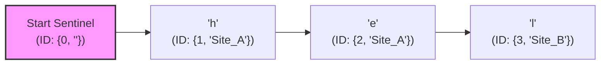

# RGA CRDT System Design

This document details the design specifications of the Replicated Growing Array (RGA) Collaborative CRDT sequence implementation used in our P2P network.

---

## 1. Why RGA?

To support collaborative text editing, we require a sequence CRDT (Conflict-free Replicated Data Type) that satisfies three core properties:
1. **Convergence:** All replicas must eventually reach identical states given the same set of operations, regardless of delivery order or network delays.
2. **Intention Preservation:** If client A inserts `x` after `y`, and client B inserts `z` after `y` concurrently, the final document should preserve both edits in close proximity to `y`.
3. **No Interleaving:** RGA resolves the "interleaving problem" (which plagues simpler sequence CRDTs), ensuring that concurrent string insertions do not get mixed up.

---

## 2. Document Representation

A document is represented internally as a **doubly linked list** of character nodes starting with a sentinel root node (`StartID`).



### Node Data Structure

```go
type ID struct {
	Timestamp int64  `json:"timestamp"` // Lamport clock of creation
	SiteID    string `json:"site_id"`   // Unique client/site identifier
}

type Node struct {
	ID       ID       // Node's unique identity
	ParentID ID       // ID of the node it was inserted after
	Value    rune     // The actual character value
	Deleted  bool     // Tombstone flag
	Next     *Node    // Pointer to next node in DLL
	Prev     *Node    // Pointer to prev node in DLL
}
```

---

## 3. Conflict Resolution & Sibling Tie-Breaking

When concurrent edits target the same insertion point (siblings sharing the same `ParentID`), we must order them deterministically across all replicas without coordination.

### Sibling Priority Ordering

We compare node IDs using the following rules:
1. **Timestamp (Lamport Clock):** The node with the higher Lamport clock has higher priority (inserted closer to the parent).
2. **SiteID (Tie-breaker):** If timestamps are equal, we compare the site string identifiers lexicographically (e.g., `Site_B` beats `Site_A`).

```go
func (a ID) Compare(b ID) int {
	if a.Timestamp > b.Timestamp { return 1 }
	if a.Timestamp < b.Timestamp { return -1 }
	if a.SiteID > b.SiteID       { return 1 }
	if a.SiteID < b.SiteID       { return -1 }
	return 0
}
```

### The RGA Shift Rule Insertion

To apply a remote insertion operation for a new node `N` with parent `P`:
1. Find node `P` in the linked list (this is the initial insertion position).
2. Scan the nodes to the right (`P.Next` onwards):
   - If the current node `C` is a sibling (i.e. `C.ParentID == P.ID`):
     - If `C.ID > N.ID`, we skip `C` and continue scanning (`N` must go to the right of higher-priority siblings).
     - If `C.ID < N.ID`, we stop scanning (`N` is inserted immediately before `C`).
   - If the current node `C` is a descendant of a higher-priority sibling of `N` (i.e., walking up parent pointers of `C` leads to a sibling of `P` whose ID is greater than `N.ID`), we skip `C` and continue scanning.
   - Otherwise, we stop scanning and insert `N` at the current position.

This shift rule guarantees that concurrent sequences of characters are not interleaved.

---

## 4. Deletions and Tombstone Logic

Rather than removing nodes from the linked list on deletion (which would break the parent pointers of subsequent insertions), we mark nodes as **tombstones** by setting their `Deleted` flag to `true`.

### Out-of-Order Deletions (Buffering)
* If a delete operation arrives for a node ID that has not yet been delivered to the replica, the ID is added to a `pendingDeletes` map.
* When the insertion operation for that node eventually arrives, the node is inserted and immediately marked as deleted.

---

## 5. Performance Trade-offs

* **Pros:** Complete decentralization, high performance for edits, simple convergence verification.
* **Cons (Tombstone Bloat):** Over time, deleted characters accumulate in memory, causing metadata overhead. 
  *(Analysis shows that at a 50% deletion ratio, metadata overhead can exceed 30x the visible document size, highlighting the need for a future tombstone garbage collection/pruning protocol).*
