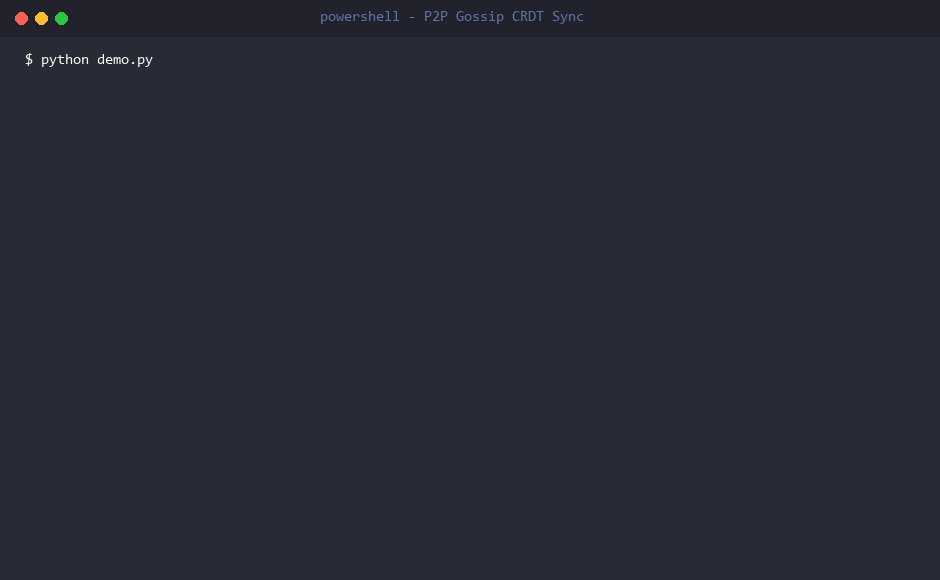
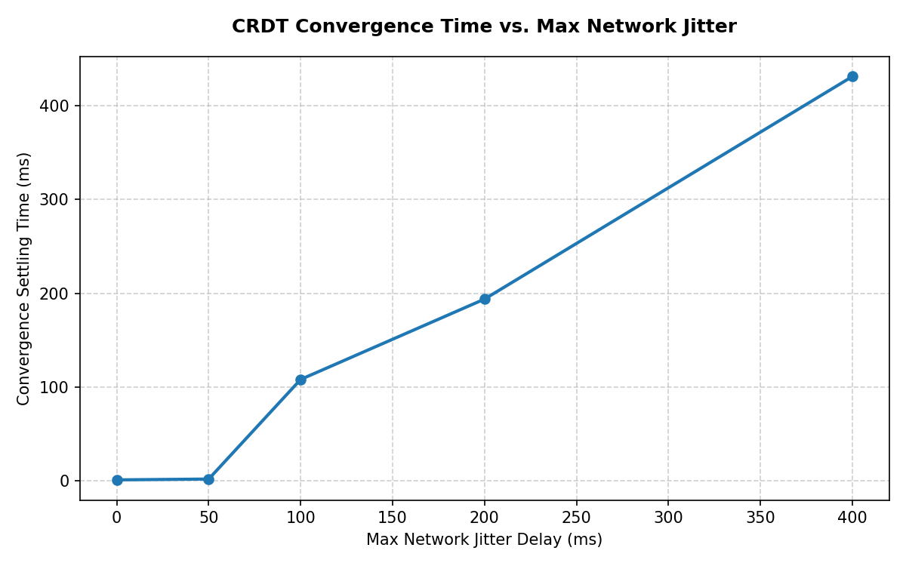
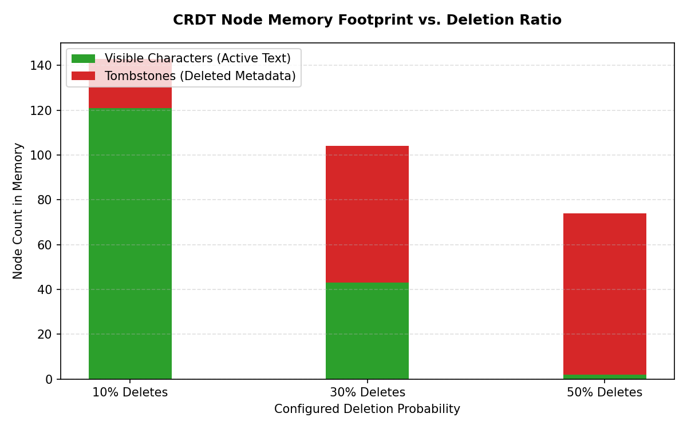

# collab-crdt

A production-grade, distributed **Collaborative Text Editing engine** built in Go, implementing the **Replicated Growing Array (RGA)** Conflict-free Replicated Data Type (CRDT) over a **Peer-to-Peer (P2P) WebSocket Gossip mesh**.

The system guarantees **strong eventual consistency** — all replica nodes will always converge to a byte-for-byte identical document state regardless of network delays, operation reordering, or concurrent edits.



---

## Table of Contents

- [Features](#features)
- [Data Structure](#data-structure)
- [Architecture](#architecture)
- [Project Structure](#project-structure)
- [Prerequisites](#prerequisites)
- [Quick Start](#quick-start)
- [Running a Multi-Server Cluster](#running-a-multi-server-cluster)
- [Live Demo](#live-demo)
- [Testing](#testing)
- [Configuration](#configuration)
- [Known Limitations](#known-limitations)
- [Further Reading](#further-reading)

---

## Features

- **RGA CRDT Algorithm** — Conflict-free concurrent text editing using a Lamport-clock-ordered doubly linked list with a sentinel root node.
- **P2P Gossip Replication** — Any number of relay servers can peer with each other. Operations are gossiped across the mesh with loop-prevention via composite `(ID, OpType)` deduplication keys.
- **Causal Ordering** — Buffered `pendingInserts` and `pendingDeletes` maps ensure out-of-order operations are applied correctly once causal dependencies arrive.
- **Thread-Safe Replicas** — All document mutations use `sync.RWMutex`, allowing concurrent reads and safe single-writer mutation from multiple goroutines.
- **Idempotent Operations** — Every `apply` call is safe to call multiple times; duplicate operations are silently rejected.
- **Peer Handshake Sync** — When two servers peer, they perform a symmetrical `MsgPeerSync` handshake to exchange and merge their full operation histories before live replication begins.
- **Diagnostics** — Built-in `PrintDebugList()` dumps the raw internal RGA linked list node-by-node, including tombstone and causal parent state.

---

## Data Structure

The document is modelled as a **Doubly Linked List of character nodes** (`*Node`), prefixed by a permanent **sentinel start node** (`StartID`).

```
[Sentinel] <-> ['H'] <-> ['e'] <-> ['l'] <-> ['l'] <-> ['o']
  ID:{0,""}    ID:{1,A}  ID:{2,A}  ID:{3,B}  ID:{4,A}  ID:{5,A}
```

### Node

```go
type Node struct {
    ID       ID     // Unique identity: {LamportClock, SiteID}
    ParentID ID     // The node this was inserted after
    Value    rune   // Character value
    Deleted  bool   // Tombstone flag (logical deletion)
    Next     *Node
    Prev     *Node
}
```

### Unique ID (Lamport Clock + Site)

```go
type ID struct {
    Timestamp int64  // Lamport logical clock — incremented on every local insert
    SiteID    string // Unique client/site identifier
}
```

### Conflict Resolution (RGA Shift Rule)

When two clients concurrently insert after the same parent node, the **RGA Shift Rule** deterministically resolves the tie:

1. Nodes are compared by `Timestamp` (descending) — newer insertions have higher priority.
2. On equal timestamps, `SiteID` is compared lexicographically (descending) as a tie-breaker.
3. The new node scans rightward past all higher-priority concurrent siblings (and their descendants) before inserting itself.

This guarantees an identical total order across all replicas with zero coordination.

### Deletion (Tombstones)

Characters are **never physically removed** from the linked list. Instead, their `Deleted` flag is set to `true`. This preserves parent pointers for subsequent insertions that may depend on a deleted node's position.

> ⚠️ Tombstone accumulation is a known trade-off. At high deletion ratios, the internal list can hold significantly more nodes than the visible document length. A tombstone GC/pruning protocol is identified as a future improvement.

---

## Architecture

```
 Client A ──ws://──► Server A (port 8080) ◄──/peer──► Server B (port 8082) ◄──ws://── Client B
                          │                                    │
                     local relay                          local relay
                      to all                              to all
                    clients on A                        clients on B
```

- **`/ws`** — Client WebSocket endpoint. Clients connect here to join a document session.
- **`/peer`** — Server-to-server WebSocket endpoint. Servers use this to exchange operation histories and gossip live edits.

### Message Protocol

All communication is JSON-serialized over WebSocket.

| Message Type  | Direction           | Purpose                                           |
|---------------|---------------------|---------------------------------------------------|
| `sync`        | Client → Server     | Join a document room by `doc_id`                  |
| `init`        | Server → Client     | Send full operation history to a newly joined client |
| `op`          | Client ↔ Server ↔ Peer | Carry a single insert or delete operation        |
| `peer-sync`   | Peer ↔ Peer         | Symmetrical handshake exchanging all document histories |

### Concurrency Model

| Lock          | Guards                                                   |
|---------------|----------------------------------------------------------|
| `Server.RWMutex` | The `sessions` map (document rooms)                 |
| `Session.Mutex`  | The client set and operation `history` for one document |
| `Server.peersMu` | The connected `peers` set                           |
| `Document.RWMutex` | All reads/writes to the RGA node list            |

---

## Project Structure

```
collab-crdt/
├── cmd/
│   ├── client/          # Standalone simulation client binary
│   │   └── main.go
│   ├── server/          # Relay server binary (supports -port and -peers flags)
│   │   └── main.go
│   └── simulation/      # In-process multi-client convergence simulator
│       └── main.go
├── internal/
│   ├── crdt/
│   │   ├── rga.go       # RGA CRDT: Node, Document, ID, Op — core data structure
│   │   └── rga_test.go  # Unit tests: basic ops, tie-breaking, causal ordering
│   └── sync/
│       ├── server.go    # WebSocket relay + P2P gossip server
│       └── server_test.go # Integration tests: relay, broadcast, late-join
├── chaos/
│   ├── chaos_test.py        # Chaos harness: network delay/jitter/drop testing
│   └── multi_server_test.py # Integration test: 2-server P2P convergence stress test
├── demo.py              # Live orchestrated demo script (servers + clients + convergence report)
├── generate_gif.py      # Captures live demo.py execution into demo.gif via Pillow
├── ARCHITECTURE.md      # Distributed system topology and protocol specification
├── DESIGN.md            # RGA CRDT algorithm design and conflict resolution specification
├── go.mod
└── go.sum
```

---

## Prerequisites

| Tool              | Version  | Purpose                             |
|-------------------|----------|-------------------------------------|
| Go                | ≥ 1.21   | Build and run server/client binaries |
| Python            | ≥ 3.10   | Run the demo and chaos test scripts  |
| Pillow (`pip`)    | ≥ 10.0   | GIF generation via `generate_gif.py` |

Install Python dependencies:

```bash
python -m venv venv
# Windows
.\venv\Scripts\activate
# macOS/Linux
source venv/bin/activate

pip install Pillow
```

---

## Quick Start

### 1. Clone the repository

```bash
git clone https://github.com/your-username/collab-crdt.git
cd collab-crdt
```

### 2. Install Go dependencies

```bash
go mod tidy
```

### 3. Run the in-process convergence simulation

The fastest way to verify the CRDT logic. Spins up a local relay server and three concurrent client replicas in the same process, then asserts convergence:

```bash
go run ./cmd/simulation
```

Expected output:

```
[Client_Alpha] length: 18 | content: "xkzabcnwpqtfmevudy"
[Client_Beta]  length: 18 | content: "xkzabcnwpqtfmevudy"
[Client_Gamma] length: 18 | content: "xkzabcnwpqtfmevudy"
SUCCESS: All client replicas successfully converged to the exact same text representation!
```

### 4. Run the Go unit and integration tests

```bash
go test ./...
```

---

## Running a Multi-Server Cluster

Build the binaries first:

```bash
go build -o server.exe ./cmd/server
go build -o client.exe ./cmd/client
```

Start **Server A** on port `8080`, peering with Server B:

```bash
./server.exe -port 8080 -peers ws://localhost:8082/peer
```

In a second terminal, start **Server B** on port `8082`, peering with Server A:

```bash
./server.exe -port 8082 -peers ws://localhost:8080/peer
```

In a third terminal, connect **Client A** to Server A:

```bash
./client.exe -url ws://localhost:8080/ws -site Site_A -doc my-doc -duration 5
```

In a fourth terminal, connect **Client B** to Server B:

```bash
./client.exe -url ws://localhost:8082/ws -site Site_B -doc my-doc -duration 5
```

Both clients will edit concurrently across separate servers. After the duration ends, the `RESULT:` output lines from both clients will show the identical converged document string.

---

## Live Demo

Run the full orchestrated demonstration with live P2P gossip streaming:

```bash
python demo.py
```

This will:
1. Compile `server.exe` and `client.exe` from source.
2. Boot a 2-node P2P gossip cluster on ports `8080` and `8082`.
3. Connect two concurrent typist clients on separate servers.
4. Stream live `[P2P]` gossip operation relays to your terminal.
5. Print a final **Convergence Report** with SHA-256 hash verification.

To generate an animated `demo.gif` from a real live execution:

```bash
python generate_gif.py
```

---

## Testing

### Unit Tests (CRDT Algorithm)

Located in `internal/crdt/rga_test.go`. Cover:

| Test                        | What it validates                                              |
|-----------------------------|----------------------------------------------------------------|
| `TestBasicOperations`       | Sequential inserts and deletes, idempotency on re-apply       |
| `TestConcurrentTieBreaking` | Two concurrent inserts at same position resolve identically   |
| `TestDelayedOperations`     | Causal buffering: out-of-order ops applied once parents arrive|
| `TestDeleteBeforeInsert`    | Delete arriving before insert correctly tombstones the node   |
| `TestCommutativityProperty` | Property test: 5 replicas with 5 random op orderings all converge |

### Integration Tests (WebSocket Relay)

Located in `internal/sync/server_test.go`. Cover:

| Test                     | What it validates                                                  |
|--------------------------|--------------------------------------------------------------------|
| `TestServerSyncAndRelay` | Two clients join, op from A relays to B; late-joining C gets history |

### Chaos / Multi-Server Tests

Located in `chaos/`. Python-based; require the Go binaries to be pre-built.

```bash
# Run the P2P convergence stress test (2 servers, 2 clients, 15 trials)
python chaos/multi_server_test.py

# Run the network chaos test (latency/jitter simulation)
python chaos/chaos_test.py
```

To run all metrics experiments and regenerate the plots:

```bash
python chaos/run_metrics.py
```

---

### Benchmark Results

The following plots were generated by `chaos/run_metrics.py` against a live relay server using the Python chaos proxy.

#### Experiment 1 — Convergence Time vs. Network Latency

Measures how long it takes for all replicas to reach the same document state as artificial latency and jitter are increased on client connections.



Convergence time scales linearly with network jitter. The RGA CRDT resolves all buffered out-of-order operations correctly as soon as they emerge from the delay pipeline — there is no retry or re-reconciliation overhead.

#### Experiment 2 — Tombstone Memory Footprint vs. Deletion Rate

Measures the total number of RGA nodes (visible + tombstoned) relative to the visible document length as the proportion of delete operations is increased.



At a **50% deletion rate**, the internal RGA linked list retains **~37× more nodes** than the visible document length due to tombstone accumulation. This confirms that a tombstone garbage collection / pruning protocol is critical for long-lived production documents.

---

## Configuration

### Server CLI flags

| Flag      | Default | Description                                              |
|-----------|---------|----------------------------------------------------------|
| `-port`   | `8080`  | Port for the relay server to listen on                   |
| `-peers`  | `""`    | Comma-separated `ws://` URLs of sibling servers to peer with |

### Client CLI flags

| Flag        | Default                       | Description                                 |
|-------------|-------------------------------|---------------------------------------------|
| `-url`      | `ws://localhost:8080/ws`      | WebSocket URL of the relay server to connect to |
| `-doc`      | `shared-doc`                  | Document session ID                          |
| `-site`     | `client-site`                 | Unique site/replica identifier               |
| `-duration` | `3`                           | Duration (seconds) to run the typing simulation |
| `-delete`   | `0.2`                         | Probability (0.0–1.0) of each operation being a delete |

---

## Known Limitations

| Issue                     | Description                                                              |
|---------------------------|--------------------------------------------------------------------------|
| **Tombstone bloat**       | Deleted nodes remain in memory indefinitely. At 50% deletion rates, the internal list can be 30× larger than the visible document. A GC/pruning protocol is planned. |
| **Broadcast flooding**    | The current gossip model floods all peers. For networks with >10 servers, a structured gossip (e.g., SWIM or gossip fan-out limiting) should replace simple flooding. |
| **No persistence**        | All session state is in-memory. A server restart clears all document history. |
| **No access control**     | Any client knowing the server URL can join any `doc_id` session. |

---

## Further Reading

- [DESIGN.md](./DESIGN.md) — RGA CRDT algorithm specification, node structure, and conflict resolution rules.
- [ARCHITECTURE.md](./ARCHITECTURE.md) — P2P gossip network topology, message protocol, and concurrency model.
- [Attiya et al., 2016 — *Analysis of the WOOT CRDT*](https://dl.acm.org/doi/10.1145/2933057.2933090)
- [Roh et al., 2011 — *Replicated Abstract Data Types: Building Blocks for Collaborative Applications*](https://www.sciencedirect.com/science/article/pii/S0743731510002832) — Original RGA paper.
- [gorilla/websocket](https://github.com/gorilla/websocket) — WebSocket library used for client and peer connections.
